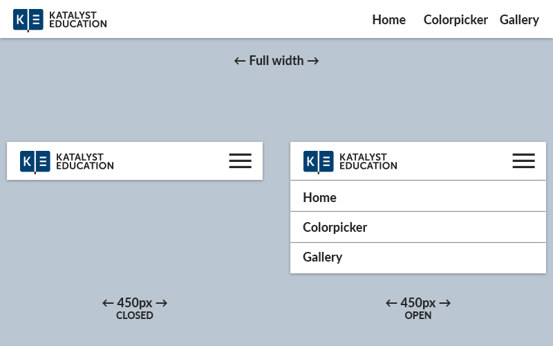
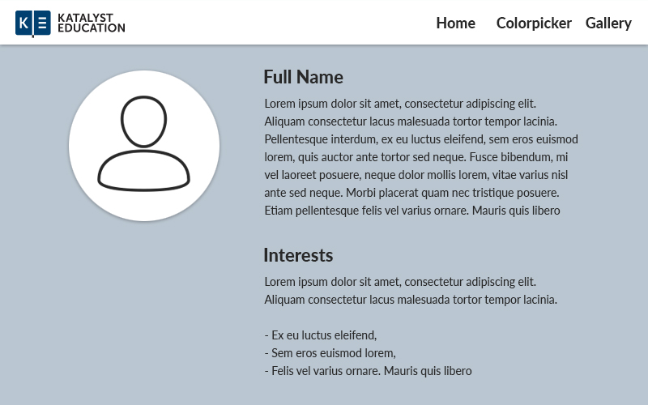
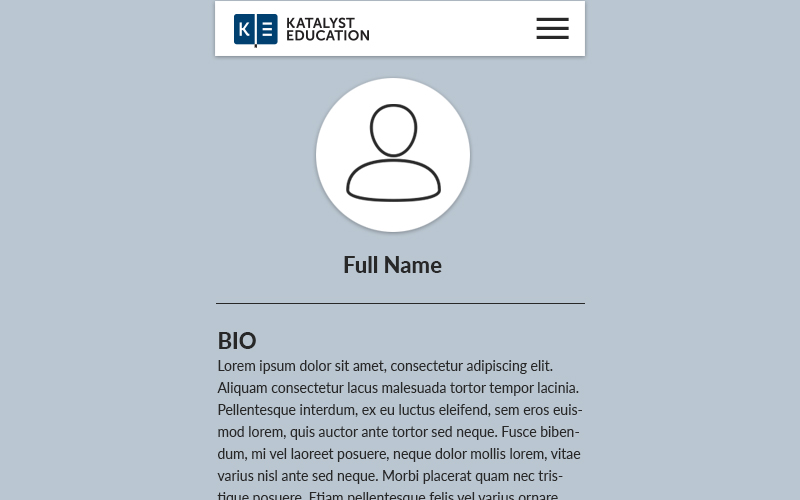
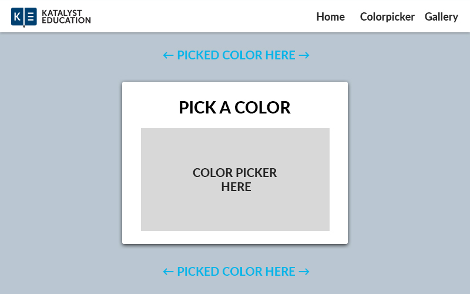
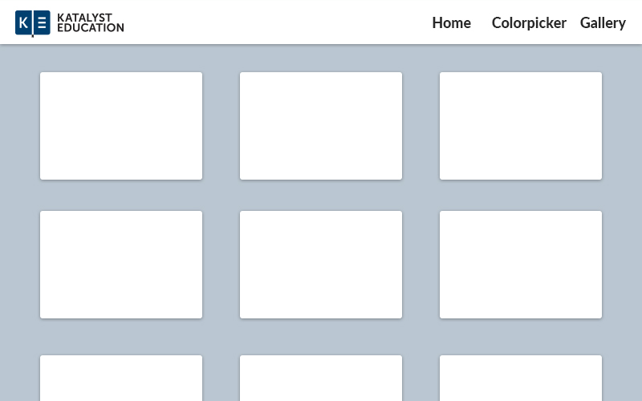
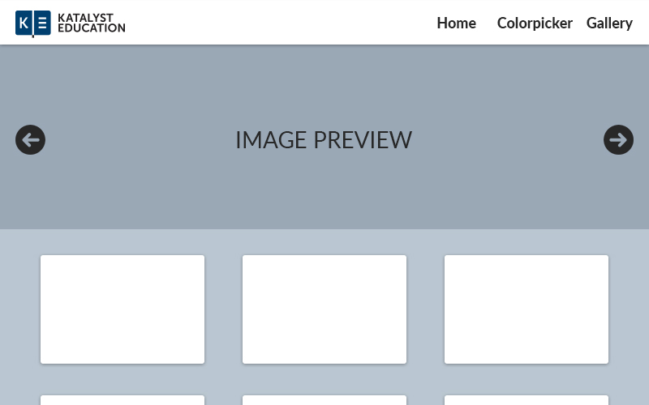
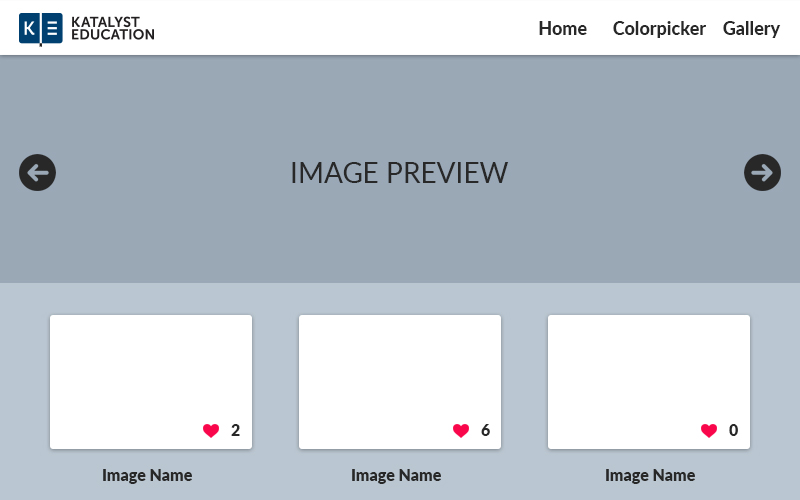
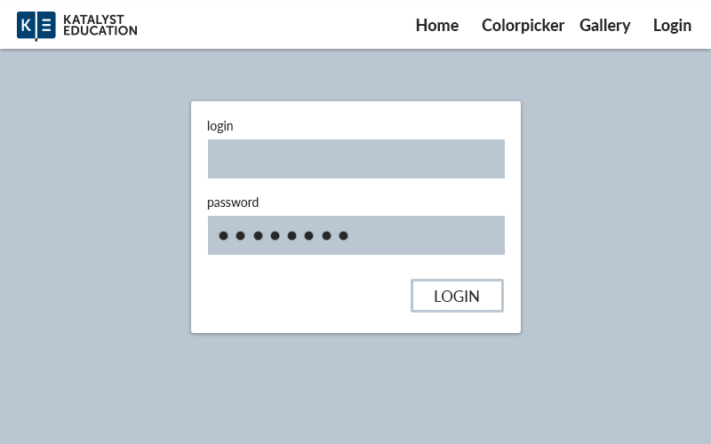
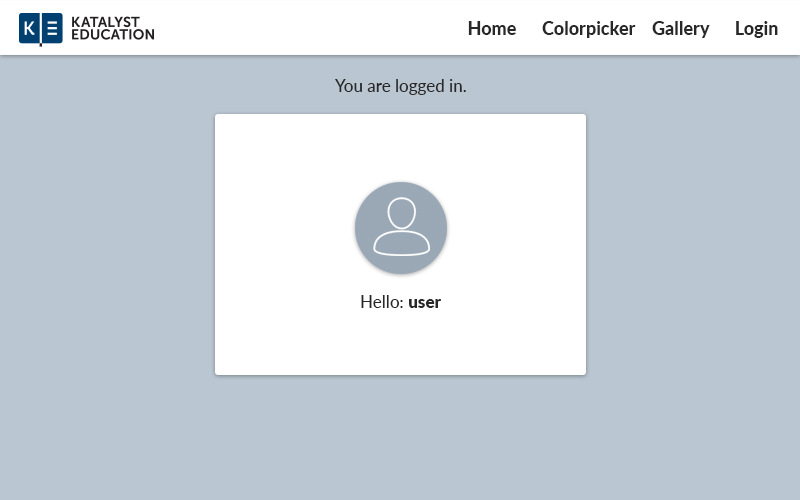
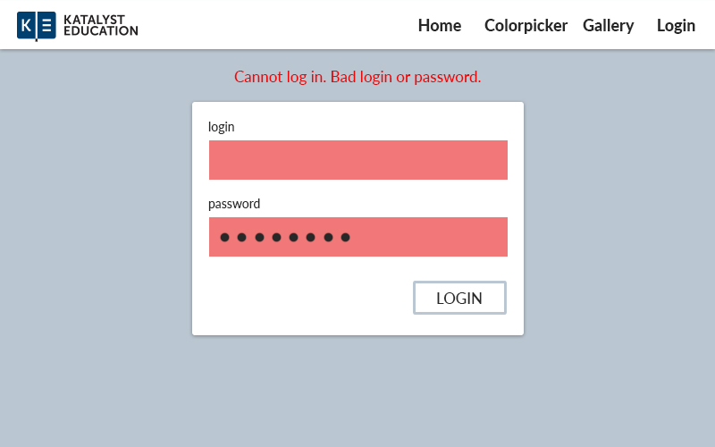

## ❶ Responsive menu

Create webpage with menu bar at the top of the page, that responds to browser's window width. When window with is lower than `450px` menu bar will change to the mobile collapsed menu with hamburger icon `☰`. Mind that menu should be stick to the top of the page when scrolling.

**Menu Items**
 - Home
 - Color picker
 - Galery




## ❷ Home page I
> Basic layout

Fill out the Home page with some informations about the user. (It could be your data on made up)
- Image/avatar
- Name
- Interets
- Short bio

**Important:** Recreate the layout that is on the mockup below ↓




## ❸ Home page II
> Basic responsive page

Update CSS stylesheet with media queries for the home page that allow you to view it on the mobile with layout presented below ↓



## ❹ Color Picker

Crate subpaage with widget that allow users to pick a color from a panel and then changes the background color to selected one.

 1. Use native HTML color picker (warm up)
 2. Create your own color picker. You don't need to include color wheel or saturation slider, buttons with colors will be enough. Take time to think about UI design.




## ❺ Image gallery I
> Working with grid

Using CSS `grid` and/or `flexbox` create a subpage with image gallery tha can be viewed both in desktop and mobile view ↓. Gallery should respond to the window size.
Gallery should contains at least 9 images.




## ❻ Image gallery II
> Combine JS and CSS - image preview

Add image preview functionality to the gallery webpage so the clicked image can be displayed at the top oc the page. Add arrows to enable navigating through the images (next/previous) ↓



## ❼ Image gallery III
> PHP + HTTP Requests

Create `PHP` script that cane be called via JS `fetch` method to reteive data about images that need to be displayed in the gallery. Script should return a JSON object with proper headers and should have following structure:
```
[
  {
    "name": "image name",
    "src": "url/to/the/image.jpg",
    "likes": 2
  },
  ...
]
```

In response to given object gallery should:
- Display image
- Display image name
- Display number of likes
- Be responsive



## ❽ Image gallery IV
> Events delagation & DOM updates

Use an event delegation mechanisms to update count of the likes in image when user clicks on the heart icon.

## ❾ Sending data
> PHP + Http Requests

Add `Login` subpage that allow user to log in with following credentials:

```
  Login: user
  Password: my-secret-password
```



Create php script `login.php` that handles `POST` request and verify the credentials. Server should send two kind of messages:
- **Success** that allows frontend to show user hidden data
- **Error** that tigres another login process

In response to the server message frontend should either:

Show **Success screen** if servers responders with success ↓



Show **Login and error message** if servers responders with error ↓


